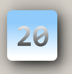

# 自定义按钮样式
使用的是继承QPushButton的形式，重载PaintEvent方法，除此之外，提供了画圆角矩形的方法（用的是QPainterPath），支持自定义圆角位置弧度

<table>
<caption>圆角矩形枚举位置表</caption>
<tr>
    <th>一级枚举</th>
    <th>二级枚举</th>
    <th>三级枚举</th>
    <th>枚举位置</th>
</tr>
<tr>
    <td align="center">topLeft</td>
    <td rowspan="2" align="center">top</td>
    <td rowspan="4" align="center">All</td>
    <td align="center">左上</td>
</tr>
<tr>
    <td align="center">topRight</td>
    <td align="center">右上</td>
</tr>
<tr>
    <td align="center">bottomRight</td>
    <td rowspan="2" align="center">bottom</td>
    <td align="center">右下</td>
</tr>
<tr>
    <td align="center">bottomLeft</td>
    <td align="center">左下</td>
</tr>
</table>

使用方式如下：
```c++
ButtonUtility::getRadiusRectPath(rect(),10,All);
ButtonUtility::getRadiusRectPath(rect(),10,topLeft|topRight|bottomRight|bottomLeft);
有同等效果
```
效果图如下(有点击效果，不好截图)：<br>

